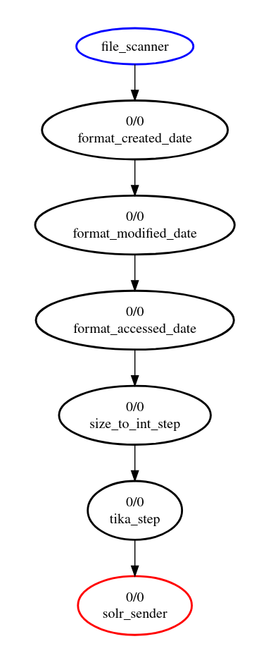

= index-solr-ref-guide

An example of using JesterJ to index html, that hopefully grows to become more than at trivial example

== Pre-Requisites
1. Solr Cloud installed where JesterJ can see it and zookeeper.
1. Java 11 installed (17+ won't work for JesterJ yet)
1. Ability to build or download solr refguide

== Steps:

1. Get the ref guide. You will need to build the ref guide as shown below (this may get checked in for convenience at a later date)
+
[source,bash]
----
cd /dir/you/checked/out/solr/in

./gradlew :solr:solr-ref-guide:buildLocalSite
----

1. Update the build with the info for your solr's zookeeper
+
[source,text]
----
solr {
  zkHost 'localhost:2181/solr'   <<<<<<<<<< update this if required
  confName 'ref-guide'
  confDir 'src/main/solr/configs/ref-guide'
}
----

1. Start solr, and upload the configset for this project via
+
[source,bash]
----
cd /dir/you/checked/out/this/project

./gradlew upconfig
----

1. Then in org.jesterj.index.refguide.SolrRefguideConfig paste the absolute path to /solr/solr/solr-ref-guide/build/site into
+
[source,java]
----
File refGuideAbsoluteLocation = new File("YOUR__PATH__HERE");
----

1. Adjust zookeeper settings here:
+
[source, java]
----
sendToSolrBuilder
    .named("solr_sender")
    .withProcessor(
        new SendToSolrCloudProcessor.Builder()
            .named("solr_processor")
            .withZookeeper("YOUR_ZK:2181/ZK_ROOT_IF_APPLICABLE")
----

1. Download JesterJ 1.0.0 node-jar here: https://github.com/nsoft/jesterj/releases

1. Build this project via
+
[source,bash]
----
export JAVA_HOME=/home/gus/.jdks/azul-11.0.19
./gradlew packageUnoJar
----

1. Index the ref guide!
+
[source,bash]
----
export JAVA_HOME=/home/gus/.jdks/azul-11.0.19
$JAVA_HOME/bin/java -jar jesterj-ingest-1.0.0-node.jar build/libs/index-solr-ref-guide-1.0-SNAPSHOT-dep.jar solrrefguide s3cret
----

You will see a few exceptions, but this is just some image files that Tika doesn't like, and after 3 tries JesterJ will mark those files dead and ignore them ever after. JesterJ will continue to run and every minute it will check for changes to the files. Any ref guide files that are updated will be re-indexed.

If you want to re-index for some reason, the easiest thing to do is delete `~/.jj/solrrefguide` which holds all the JesterJ logs, and the files for the cassandra database.

You may notice that JesterJ regularly logs a graphviz visualization of its current state. You can paste that at https://dreampuf.github.io/GraphvizOnline/ and you will get something that looks like:

