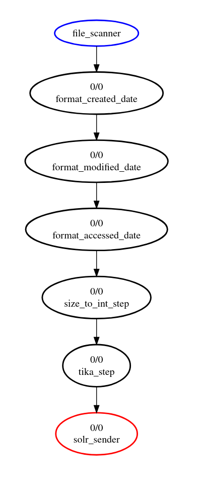

= index-solr-ref-guide

An example of using https://github.com/nsoft/jesterj[JesterJ] to index html, that hopefully grows to become more than at trivial example

[#_pre_requisites]
== Pre-Requisites
1. Linux/bash environment
1. Zookeeper accessible via localhost:2181
1. Able to modify current directory
1. Able to reach github & have git installed (no auth req)
1. Ports 5001-5004, 7981-7984 and 8981-8984 are not used for other purposes (used by solr)
1. Ports 7000 and 9042 must be available (used by JesterJ cassandra)
1. Able to create/modify contents of `~/.jj` directory (jesterj puts logs and cassandra db here)
1. `jq` command line utility must be installed

== Recommended
The get-solr.sh script has been tested locally, and on AWS instance. Since we will be running runs all of zookeeper, solr and jesterj, the smallest instances won't work very well. The following are recommended machine capabilities.

1. 32GB ram
1. 4 cpus
1. at least 6GB free space
1. on AWS, r6gd.xlarge worked like a charm, but r6gd.large wedged hard and had to be forcefully stopped.

== Steps:

1. Ensure java is available, preferrably java 21 is the system JDK for solr/zookeeper

1. Download and install zookeeper listening to localhost on its default port (2181).
There is no need to set anything up in zookeeper, and you only need a single node running.
There is no benefit to having a multi-node quorum for a toy installation like this.

1. Download and unpack a JDK 11 - this is required by JesterJ (for a little while longer)

1. Ensure you are in the same directory as this README file.

1. Export the JDK_11_HOME environment variable (adjust to your install location/distro)
+
[source,bash]
----
export JAVA_11_HOME=~/tools/zulu11.72.19-ca-jdk11.0.23-linux_x64
----

1. Run the script with -S and -j args to download, build and run solr, then download and run jesterj. If all goes well you should be able to see documents in solr at http://localhost:8981/solr/#/ref_guide/query within several minutes (most of which is setup/building and startup of solr )
+
[source,bash]
----r
get-solr.sh -Sj
----

1. Whenever you want to update to the latest version of the ref guide, just run the script without any arguments. This also updates the configset and reloads the collection in solr.
+
[source,bash]
----
get-solr.sh
----

You will see a few exceptions in JesterJ logs (at `~/jj/solrrefguide/logs/jj.log`), but this is just some image files that Tika doesn't like, and after 3 tries JesterJ will mark those files dead and ignore them ever after. JesterJ will continue to run and every minute it will check for changes to the files. Any ref guide files that are updated will be re-indexed.

If you want to re-index for some reason, the easiest thing to do is delete `~/.jj/solrrefguide` which holds all the JesterJ logs, and the files for the cassandra database.

You may notice that JesterJ regularly logs a graphviz visualization of its current state. This will look something like:
[source,bash]
----
digraph "visualize" {
"file_scanner" ["color"="blue","penwidth"="2.0","style"="filled","fillcolor"="white","label"="file_scanner"]
"RemoveNavs" ["color"="black","penwidth"="2.0","style"="filled","fillcolor"="white","label"="0/0\nRemoveNavs"]
"format_created_date" ["color"="black","penwidth"="2.0","style"="filled","fillcolor"="white","label"="0/0\nformat_created_date"]
"format_modified_date" ["color"="black","penwidth"="2.0","style"="filled","fillcolor"="white","label"="0/0\nformat_modified_date"]
"format_accessed_date" ["color"="black","penwidth"="2.0","style"="filled","fillcolor"="white","label"="0/0\nformat_accessed_date"]
"size_to_int_step" ["color"="black","penwidth"="2.0","style"="filled","fillcolor"="white","label"="0/0\nsize_to_int_step"]
"tika_step" ["color"="black","penwidth"="2.0","style"="filled","fillcolor"="white","label"="0/0\ntika_step"]
"solr_sender" ["color"="red","penwidth"="2.0","style"="filled","fillcolor"="white","label"="0/0\nsolr_sender"]
"file_scanner" -> "RemoveNavs"
"RemoveNavs" -> "format_created_date"
"format_created_date" -> "format_modified_date"
"format_modified_date" -> "format_accessed_date"
"format_accessed_date" -> "size_to_int_step"
"size_to_int_step" -> "tika_step"
"tika_step" -> "solr_sender"
}

----

You can paste that at https://dreampuf.github.io/GraphvizOnline/ and you will get something that looks like:

